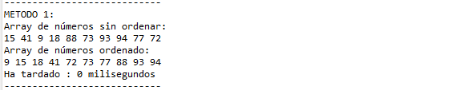
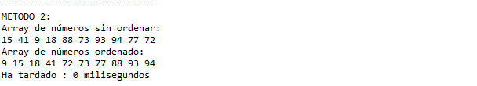
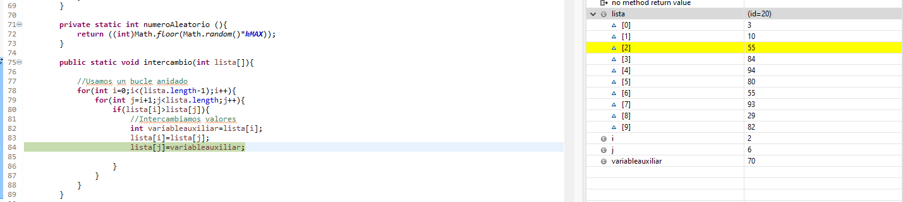
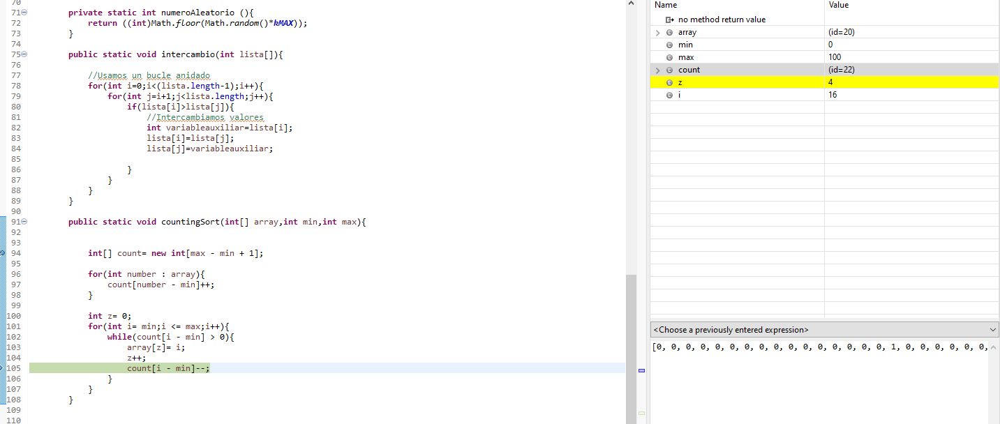

# Depuración 2

#### 1 Explicar qué hace el método main.

Crea dos arrays de enteros, del tamaño de la constante tamanyo.

    final int TAMANYO=10;
	    int lista[]=new int [TAMANYO];
	    int lista2[]=new int [TAMANYO];

Los rellena llamando al metodo rellenaArrays() dando los mismos valores para las mismas posiciones, con un valor generado aleatoriamente entre 0 y kMAX (siendo kMAX una constante de valor 100).

    for(int i=0;i<lista.length;i++){
	    aleat=numeroAleatorio();
	    lista[i]=aleat;
	    lista2[i]=aleat;
    }

Tras esto imprime los valores del primer array mediante el método imprimeArray(), en este momento coincidiran con los del segundo array.

Creando dos variables de tipo long, se ordena el array uno utilizando el método intercambio(), y vuelve a imprimir el array esta vez con los valores ordenados. Restando las variables long creadas calcula el tiempo que ha tardado en ordenar el array, pues una se crea antes de la llamada al método y otra despues.

    long time1=System.currentTimeMillis();	        
	intercambio(lista);
	long time2=System.currentTimeMillis();
	

Y por último realiza el mismo proceso para el array 2 pero utilizando el metodo countingSort().

#### 2 Poner un punto de ruptura (breakpoint) en la línea 78 (primer bucle del método intercambio) y, basándoos en los valores que van tomando las variables, explicad cómo funciona el método de ordenación de arrays por intercambio. Podéis crear tablas para ver cómo cambian los valores de los arrays.

Este algoritmo va buscando en el array el elemento de menor valor para almacenarlo en la posición i del array. De esta forma si encuentra en la posición j un valor de menor tamaño que el de la posición i los intercambia haciendo uso de una variable auxiliar para guardar el valor sobreescrito.

#### 3 Poner un punto de ruptura (breakpoint) en la línea 94 y explicad cómo funciona el método de ordenación de arrays de conteo. Podéis crear tablas para ver cómo cambian los valores de los arrays.

Este algoritmo crea un array con el tamaño máximo de los valores que podemos encontrar en el array lista2, el cual seria kMAX, una vez creado realiza un foreach y aumenta en uno el valor de la posición de este nuevo array teniendo en cuenta el valor del array lista2, de tal forma que si hay dos 25 y un 74, el nuevo array almacenara 0 en todas las posiciones salvo en 25, que guardara un 2, y en 74 que guardara un uno. Ahora ya solo queda volver a almacenar los valores del nuevo array en el array lista 2 de forma ordenanda.

Diria que este segundo algoritmo, si bien precisa de más memoria y requiere saber conocer el valor máximo del valor dentro del aray que se desea ordenar, es bastante más rapido que el anterior.
