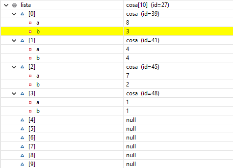
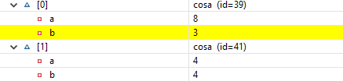

# Depuración 3

#### 1 Explicar qué hace el método main.

Lo primero que hace el main es crear un array, llamado "lista", de la clase "cosa", con un tamaño igual al de la constante kMAX creada previamente.

    cosa [] lista = new cosa[kMAX];

Tras esto el main entra en un bucle while, el cual pide un número por pantalla, y llama a un método llamado "esta", con el array de "cosa" y el número introducido.

    while(i<kMAX) {
	    System.out.println("Dime un numero: ");
	    num=sc.nextInt();

	    enc=esta(lista,num);

Si el valor devuelto con la llamada de la función "esta", es menor que el valor de la variable "c", lista actualiza su valor "B" en la posición "enc", por el valor en la posición "enc" de "B" + 1. En caso de no ser así lista en la posición "c" inicializa un "cosa" con el constructor mediante int pasandole "num", el número introducido por teclado y aumentando el valor de c en 1.

    if(enc<c) {
	    lista[enc].setB(lista[enc].getB()+1);
	}
	else {
	    lista[c] = new cosa(num);
	    c++;
	}

#### 2 Poner un punto de ruptura (breakpoint) en la línea 26 (primer bucle del método main) y, basándoos en los valores que van tomando las variables, explicad qué hace y cómo funciona el método. Podéis crear tablas para ver cómo cambian los valores de las variables y del array

El algoritmo nos va pidiendo que introduzcamos un número en cada iteración del bucle, hasta un máximo del valor de la constante kMAX, una vez introducido el número mediaente el método "esta", se determina si el valor ha sudo introducido previamente.

    public static int esta( cosa []l,int e){
	    int i;
	    for(i=0; l[i]!=null  && l[i].getA()!=e ;i++);
        return i;
	}

Si ha sido "enc"ontrado, el if hará que en la posición donde se ha encontrado, "enc", el valor de "B" aumente en uno. En caso contrario se inicializará un nuevo "cosa" en esta posición del array "lista" y cosa A almacenara el valor dado y B se inicializara como 1.

    public cosa(int a) {
	    this.a = a;
	    this.b=1;
    }
    
En conclusión lo que hace este bucle es almacenar los números que vamos introduciendo, y en caso de ya haber sido introducido en lugar de volver a almacenarlo aumenta el valor B de cosa. A es el valor introducido y B la cantidad de veces que este se ha introducido, el problema de esto es que el array no emplea todas sus posiciones reservadas, puesto que en caso de que se repita un solo número "i" sigue aumentando y las posiciones que no se inicializan quedan como null (todo esto se puede ver en la siguente captura).

#### 3 Basándoos en el funcionamiento, determinad qué indican o a qué hacen referencia las variables “a” y “b” de la clase “cosa”.

Como ya he explicado la variable "a" hace referencia al número introducido por teclado, mietras que la variable "b" nos indica la cantidad de veces que este ha sido introducido, por ejemplo:

Aquí podemos ver como el valor 8, almacenado en "a", ha sido introducido 3 veces, variable "b". Y el número 4 ha sido introducido 4 veces.
