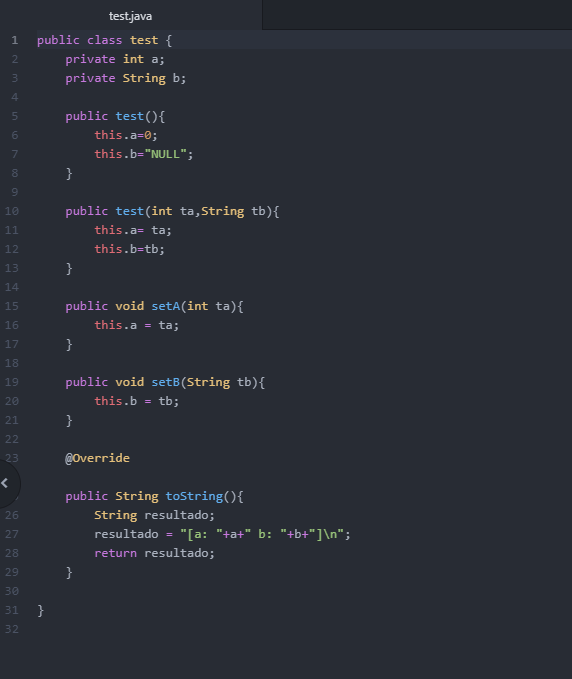
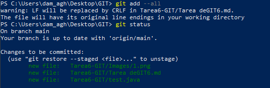
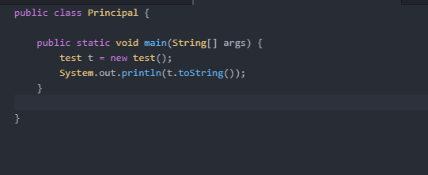
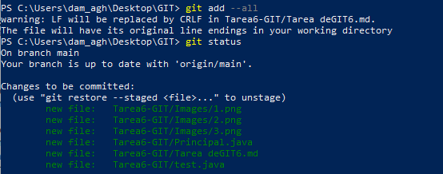
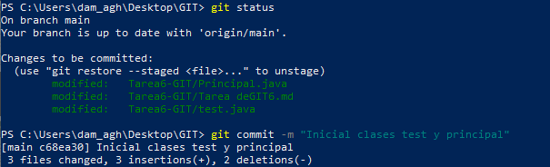
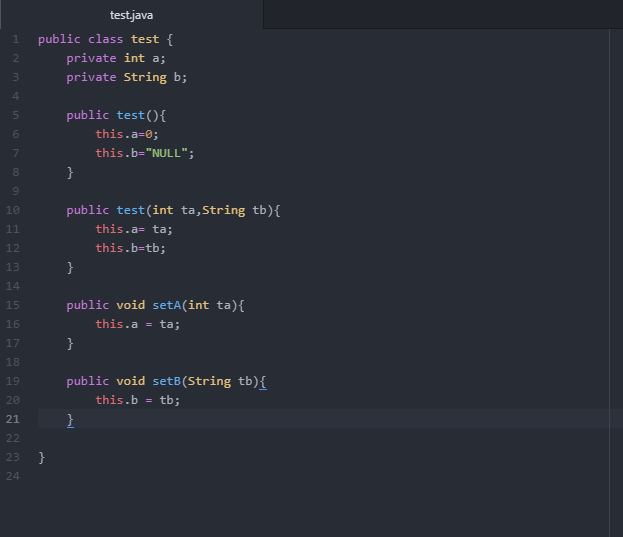
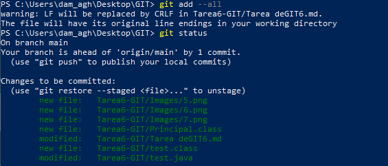
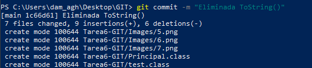
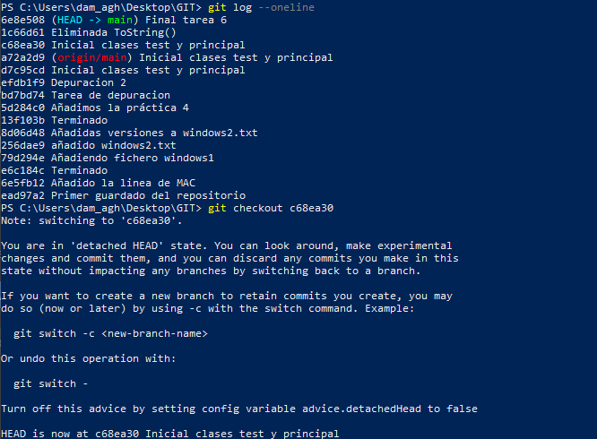

# Tarea de GIT 6

#### 1. Creamos el fichero java y lo guardamos en la carpeta de Tarea6-GIT

#### 2. Pasamos el fichero a preparado

#### 3. Creamos el fichero Principal.java

#### 4. Pasamos todo a prepatado de nuevo

#### 5. Realizamos un commit llamado “Inicial clases test y principal”

#### 6. Compilamos la salida del programa tras compilar

#### 7. Eliminamos el metodo toString()

#### 8. Pasamos el fichero a preparado

#### 9. Realizamos un nuevo commit llamado "Eliminanda ToString()"

#### 10. Comprobamos de nuevo la salida del programa

#### 11. Volvemos al estado anterior mediante el checkout y usando log

El método toString() crea un String con las variables a (de tipo int) y b (de tipo String), encadenandolos en uno solo.

La anotación @Override simplemente se utiliza, para forzar al compilador a comprobar en tiempo de compilación que estás sobrescribiendo correctamente un método, y de este modo evitar errores en tiempo de ejecución, los cuales serían mucho más difíciles de detectar.