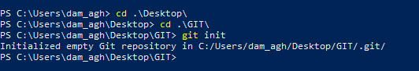
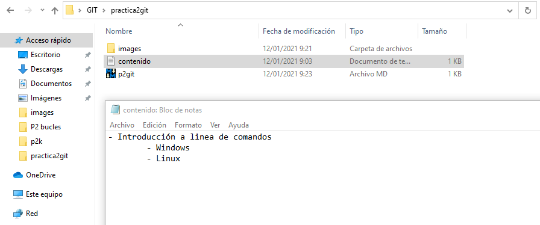
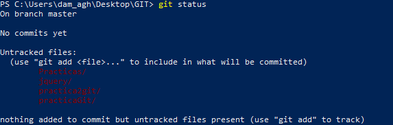
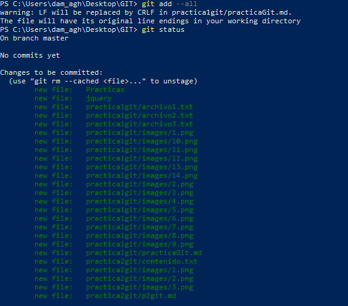
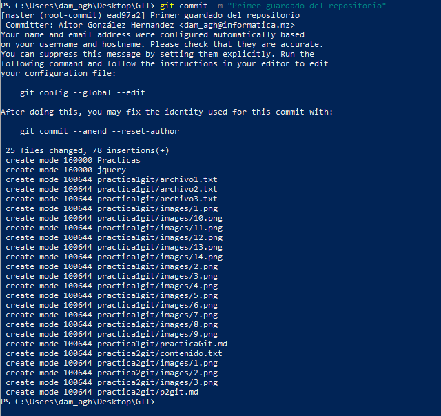
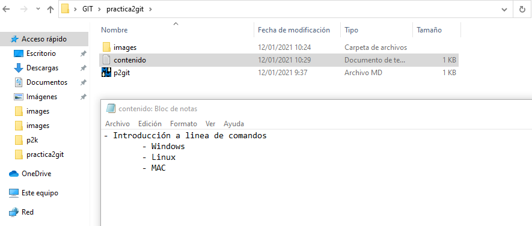
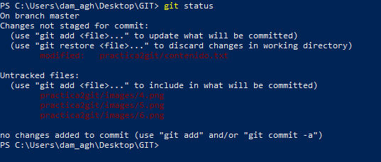
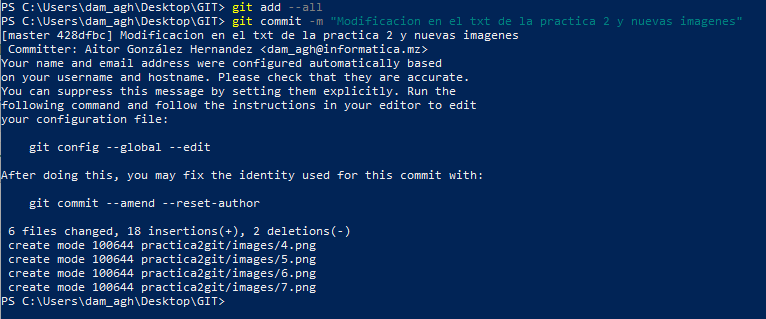
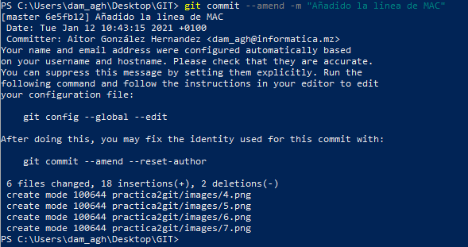

# Práctica 2 en Git

Inicializamos un repositorio en Git con el comando git init.

Creamos un fichero .txt llamado contenido y lo introducimos en una nueva carpeta llamada practica2git.

Tras esto comprobamos el estado del repositorio.

Ahora añadimos los ficheros a la zona de preparado y comprobamos de nuevo el estado.

Tras esto realizamos un commit.

Modificamos el fichero contenido.txt y volvemos a comprobar el estado del repositorio.

Añadimos los cambios a preparado y volvemos a hacer un commit.

Ya, para terminar, modificamos el comentario del ultimo commit.

