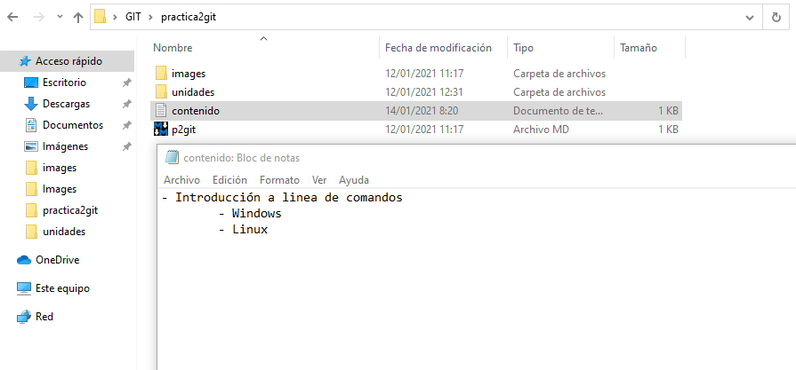
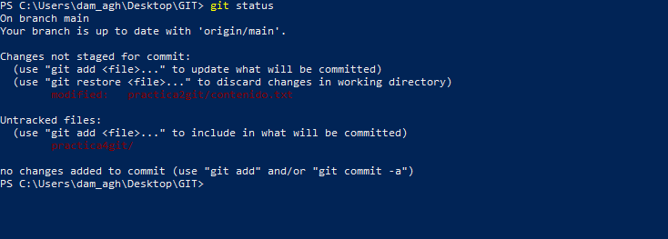
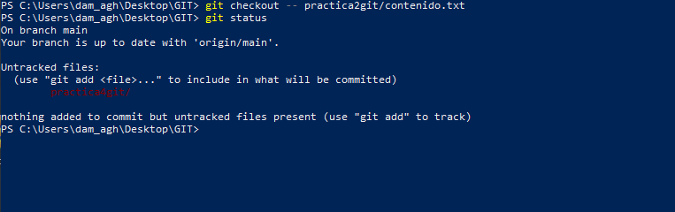
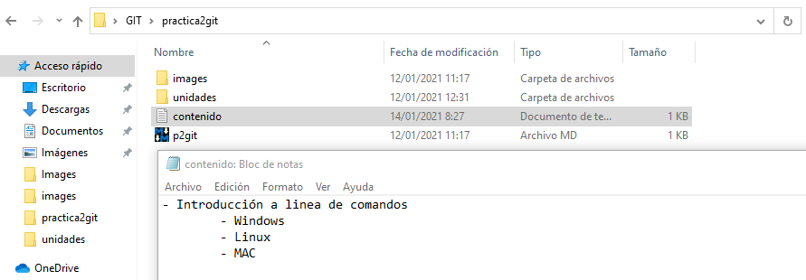
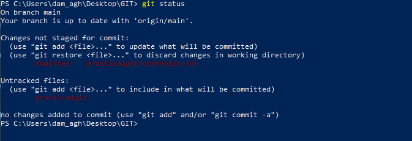
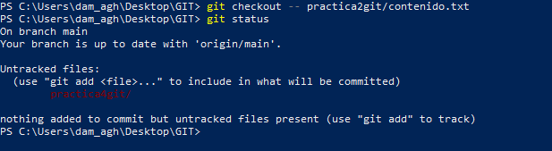

# Práctica 4 en Git

Continuamos a partir de lo realizado en la práctica 3. Lo primero que haremos sera borrar la linea de MAC del fichero contenido.txt.

Comprobamos el estado del repositorio.

Deshacemos los cambios en el fichero contenido.txt con el comando git checkout y volvemos a comprobar el estado del repositorio.

Y comprobamos que el fichero a vuelto a su estado anterior.

Eliminamos de nuevo la ultima linea de contenido.txt y guardamos.

Añadimos los cambios a la zona de preparado y volvemos a comprobar el estado.

Quitamos los cambios de la zona de intercambio temporal, manteniendo el diretorio de trabajo.

Comprobamos de nuevo el estado del repositorio.

Deshacemos los cambios realizados en el fichero contenido.txt para volver a la versión anterior y volvemos a comprobar el estado del repositorio.

